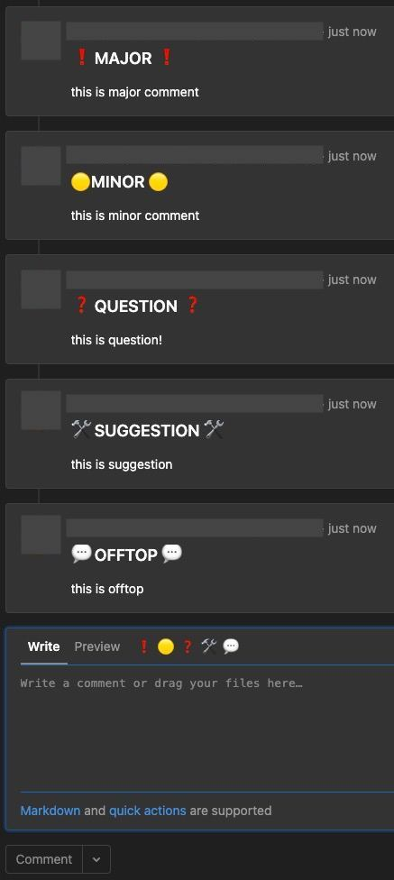

# Gitlab Code Review Helper Extension

The extension uses approach described at [Netlify article about Feedback Ladders at Code Review](https://www.netlify.com/blog/2020/03/05/feedback-ladders-how-we-encode-code-reviews-at-netlify/).

When you want to place a comment to code author, you can choose one of comment types:

- MAJOR - blocking issue
- MINOR - code author decides should issue be resolved and which way or it's not needed to be resolved
- QUESTION - it's not an issue, it's a question. Comment author asks code author to describe something.
- SUGGESTION - commenter want to suggest different version of code. It can be combined with another type and can be replaced with [native gitlab suggestion feature](https://docs.gitlab.com/ee/user/project/merge_requests/reviews/suggestions.html) (or it can combined with this feature).
- OFFTOP - something that isn't related to solution directly.

Comments examples are presented below:

## How to use

- clone the repository
- open `manifest.json` and edit `matches` option to your gitlab url.
- [load unpacked extension in google chrome's extensions settings](https://developer.chrome.com/docs/extensions/mv3/getstarted/#manifest)
  - Open the Extension Management page by navigating to chrome://extensions
  - Enable Developer Mode by clicking the toggle switch next to Developer mode.
  - Click the Load unpacked button and select the extension directory.

## Contributing

Feel free to make a PR.

# License

MIT
